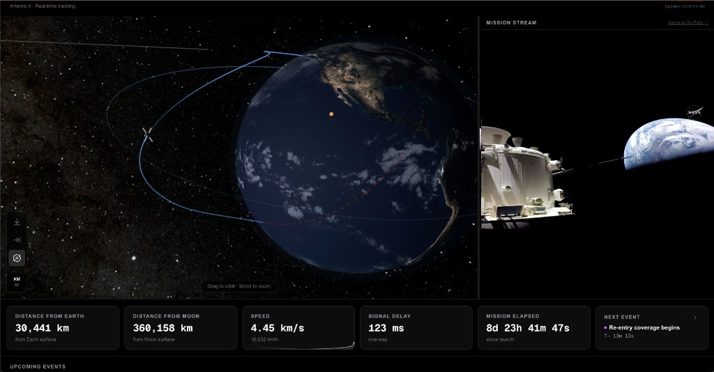

# Where Is Artemis?

Real-time 3D tracking of NASA's Artemis II mission — spacecraft position, trajectory, and mission telemetry rendered in the browser with React Three Fiber.



## Features

- **Live telemetry** — distance from Earth and Moon, current speed, signal delay, and mission elapsed time
- **3D visualization** — interactive globe with the spacecraft's past and future trajectory rendered in real time
- **Mission events** — upcoming mission milestones with a countdown timer
- **Mission stream** — embedded NASA YouTube live stream

## Tech Stack

| Layer         | Technology                                                                      |
| ------------- | ------------------------------------------------------------------------------- |
| Framework     | [Next.js 16](https://nextjs.org) (App Router)                                   |
| 3D rendering  | [React Three Fiber](https://r3f.docs.pmnd.rs) + [Three.js](https://threejs.org) |
| 3D helpers    | [@react-three/drei](https://github.com/pmndrs/drei)                             |
| Data fetching | [TanStack Query](https://tanstack.com/query)                                    |
| Styling       | [Tailwind CSS v4](https://tailwindcss.com)                                      |
| Language      | TypeScript (strict)                                                             |
| Testing       | [Vitest](https://vitest.dev) + [Testing Library](https://testing-library.com)   |

## Getting Started

```bash
pnpm install
pnpm dev
```

Open [http://localhost:3000](http://localhost:3000) in your browser.

## Scripts

| Command              | Description                          |
| -------------------- | ------------------------------------ |
| `pnpm dev`           | Start the development server         |
| `pnpm build`         | Build for production                 |
| `pnpm lint`          | Run ESLint (zero warnings tolerated) |
| `pnpm type-check`    | Run TypeScript type checking         |
| `pnpm test`          | Run the test suite                   |
| `pnpm test:coverage` | Run tests with coverage report       |

## Project Structure

```
src/
├── app/              # Next.js App Router — routes and layouts
├── components/
│   ├── ui/           # Primitive UI components
│   └── three/        # React Three Fiber canvas components
├── hooks/            # Custom React hooks
├── lib/              # Utilities and data fetching helpers
└── types/            # Shared TypeScript types
```

## License

[MIT](LICENSE)
